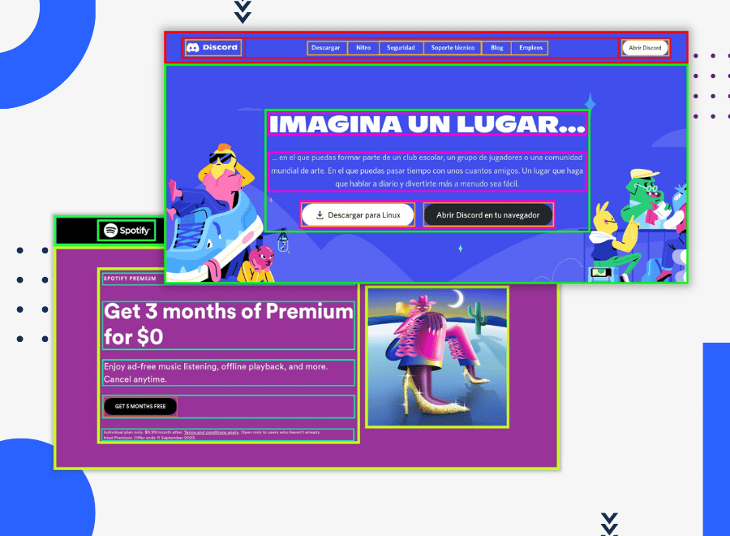

# Portafolio Desarrollo Web

Conjunto de códigos realizados en el curso de desarrollo web

  

## Screenshots:

## Parciales

### Parcial 2 ( *JavaScript + SASS* )

### Parcial 1 ( *HTML + SASS* )

## Laboratorios

### Laboratorio 4 ( ReactJS )

### Laboratorio 3 ( HTML + CSS + JS )

### Laboratorio 2 ( JavaScript )

### Laboratorio 1 ( HTML + CSS )

## Tareas

### Tarea 6 - Conceptos JS

### Tarea 5 - Sass Modules

### Tarea 4 - Grid & Position

### Tarea 3 - Flexbox Cards

### Tarea 2 - Resume

### Tarea 1 - Estructura de sitios

## Créditos:

- Algunos ejercicios son basados en la plataforma de [frontendmentor.io](https://www.frontendmentor.io/home).
- Laboratorios guiados por instructores.
- Exámenes parciales hechos en grupo con [Fernanda Vásquez](https://github.com/cam-vasquez) y [Henry Escobar](https://github.com/HenryLima07).

